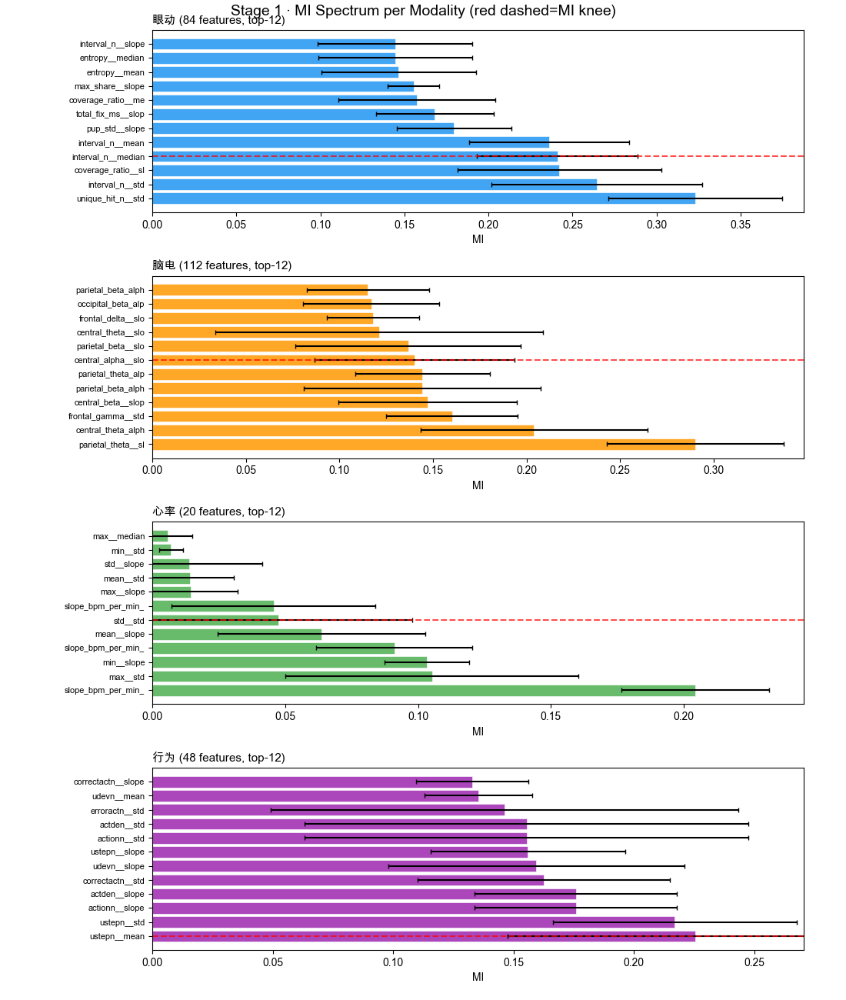
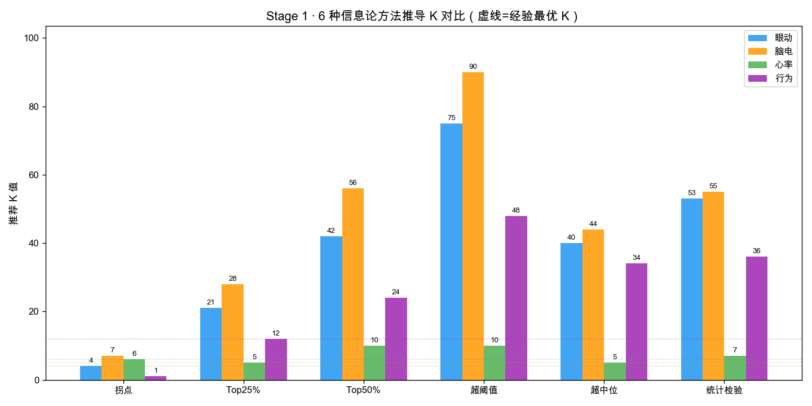
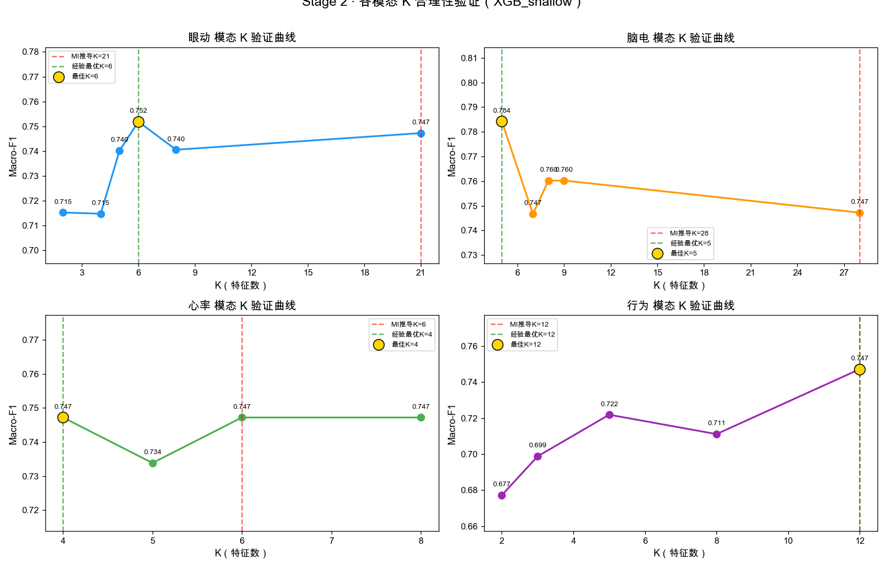
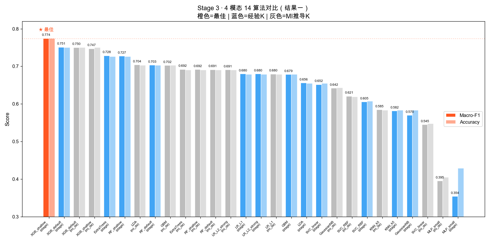
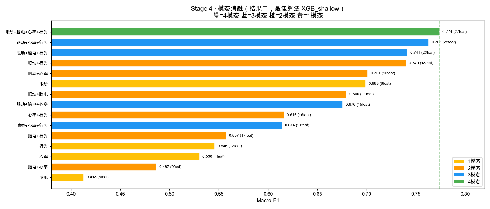
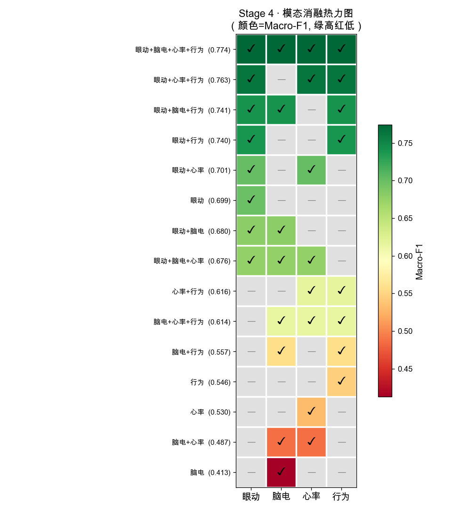
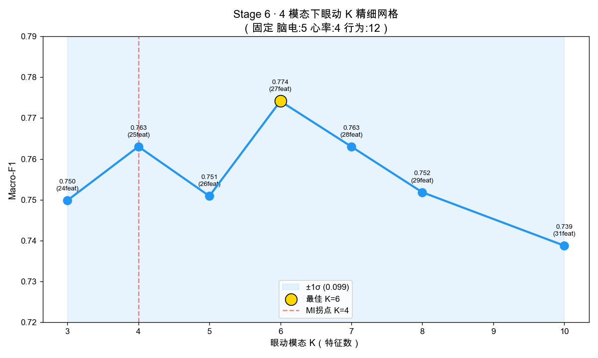
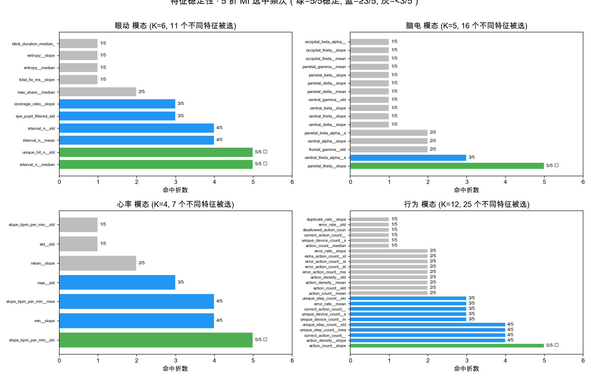

# P6 MI 特征筛选实验 · 详细结果与可视化报告

> 生成时间：2026-07-09 | 实验目录：`reports_exp6/`

---

## 文件夹结构

```
reports_exp6/
├── MI_DETAILED_REPORT.md          ← 本文件（详细整理报告）
├── report.md                       ← 自动生成报告
├── results.json                    ← 完整实验数据
├── run.log                         ← 运行日志
├── figures/                        ← 可视化图表
│   ├── 01_mi_spectrum_per_modality.png  ← 各模态MI全谱
│   ├── 02_mi_knee_analysis.png          ← MI拐点K推导对比
│   ├── 03_k_validation_curves.png       ← K验证曲线
│   ├── 04_algorithm_comparison.png      ← 14算法对比
│   ├── 05_modality_ablation.png         ← 模态消融条形图
│   ├── 06_modality_ablation_heatmap.png ← 模态消融热力图
│   ├── 07_eye_k_fine_grid.png           ← 眼动K精细网格
│   └── 08_feature_stability.png         ← 特征稳定性
└── data/                          ← 结构化CSV
    ├── mi_spectrum.csv                  ← MI全谱数据
    ├── k_validation.csv                 ← K验证结果
    ├── algorithm_comparison.csv         ← 算法对比
    ├── modality_ablation.csv            ← 模态消融
    ├── stage5_fine_tune.csv             ← Stage5精调
    └── stage6_eye_k_grid.csv            ← Stage6精细网格
```

---

## 1. MI 全谱分析





### 各模态 MI Top-10

**眼动模态**（84 特征，MI推导K=21）

| 排名 | 特征名 | MI | ±σ |
|---:|---|---:|---:|
| 1 | `eye_aoi_unique_hit_n__std` | 0.3230 | 0.0517 |
| 2 | `eye_aoi_interval_n__std` | 0.2644 | 0.0628 |
| 3 | `eye_aoi_coverage_ratio__slope` | 0.2423 | 0.0606 |
| 4 | `eye_aoi_interval_n__median` | 0.2411 | 0.0479 |
| 5 | `eye_aoi_interval_n__mean` | 0.2361 | 0.0474 |
| 6 | `eye_pupil_filtered_std__slope` | 0.1796 | 0.0343 |
| 7 | `eye_aoi_total_fix_ms__slope` | 0.1679 | 0.0350 |
| 8 | `eye_aoi_coverage_ratio__mean` | 0.1576 | 0.0466 |
| 9 | `eye_aoi_max_share__slope` | 0.1555 | 0.0154 |
| 10 | `eye_aoi_entropy__mean` | 0.1466 | 0.0460 |

**脑电模态**（112 特征，MI推导K=28）

| 排名 | 特征名 | MI | ±σ |
|---:|---|---:|---:|
| 1 | `eeg_parietal_theta_power_z_within_subject__slope` | 0.2901 | 0.0473 |
| 2 | `eeg_central_theta_alpha_z_within_subject__slope` | 0.2040 | 0.0607 |
| 3 | `eeg_frontal_gamma_power_z_within_subject__std` | 0.1602 | 0.0352 |
| 4 | `eeg_central_beta_power_z_within_subject__slope` | 0.1471 | 0.0477 |
| 5 | `eeg_parietal_beta_alpha_z_within_subject__slope` | 0.1444 | 0.0634 |
| 6 | `eeg_parietal_theta_alpha_z_within_subject__slope` | 0.1443 | 0.0360 |
| 7 | `eeg_central_alpha_power_z_within_subject__slope` | 0.1402 | 0.0535 |
| 8 | `eeg_parietal_beta_power_z_within_subject__slope` | 0.1368 | 0.0602 |
| 9 | `eeg_central_theta_power_z_within_subject__slope` | 0.1213 | 0.0875 |
| 10 | `eeg_frontal_delta_power_z_within_subject__slope` | 0.1180 | 0.0248 |

**心率模态**（20 特征，MI推导K=6）

| 排名 | 特征名 | MI | ±σ |
|---:|---|---:|---:|
| 1 | `hr_slope_bpm_per_min__slope` | 0.2043 | 0.0277 |
| 2 | `hr_max__std` | 0.1053 | 0.0552 |
| 3 | `hr_min__slope` | 0.1034 | 0.0159 |
| 4 | `hr_slope_bpm_per_min__mean` | 0.0911 | 0.0294 |
| 5 | `hr_mean__slope` | 0.0637 | 0.0390 |
| 6 | `hr_std__std` | 0.0475 | 0.0504 |
| 7 | `hr_slope_bpm_per_min__std` | 0.0456 | 0.0384 |
| 8 | `hr_max__slope` | 0.0144 | 0.0176 |
| 9 | `hr_mean__std` | 0.0143 | 0.0164 |
| 10 | `hr_std__slope` | 0.0140 | 0.0274 |

**行为模态**（48 特征，MI推导K=12）

| 排名 | 特征名 | MI | ±σ |
|---:|---|---:|---:|
| 1 | `log_unique_step_count_win__mean` | 0.2254 | 0.0780 |
| 2 | `log_unique_step_count_win__std` | 0.2169 | 0.0506 |
| 3 | `log_action_count_win__slope` | 0.1758 | 0.0421 |
| 4 | `log_action_density_win__slope` | 0.1758 | 0.0421 |
| 5 | `log_correct_action_count_win__std` | 0.1625 | 0.0523 |
| 6 | `log_unique_device_count_win__slope` | 0.1594 | 0.0614 |
| 7 | `log_unique_step_count_win__slope` | 0.1559 | 0.0403 |
| 8 | `log_action_count_win__std` | 0.1554 | 0.0921 |
| 9 | `log_action_density_win__std` | 0.1554 | 0.0921 |
| 10 | `log_error_action_count_win__std` | 0.1463 | 0.0971 |

## 2. K 合理性验证



| 模态 | MI推导K | 经验最优K | 差值 | 评价 |
|---|---:|---:|---:|---|
| 眼动 | 21 | 6 | -15 | ❌ 偏大 |
| 脑电 | 28 | 5 | -23 | ❌ 偏大 |
| 心率 | 6 | 4 | -2 | ✅ 吻合 |
| 行为 | 12 | 12 | +0 | ✅ 吻合 |

## 3. 算法对比（结果一）



**★ 最佳算法 = XGB_shallow (K集=stage2_empirical)，F1 = 0.774**

Top-5 算法：

| 排名 | K集 | 模型 | 特征数 | F1 | fold F1 μ±σ |
|---:|---|---|---:|---:|---:|
| 1 | stage2_empirical | XGB_shallow | 27 | **0.774** | 0.777±0.099 |
| 2 | stage2_empirical | XGB_default | 27 | **0.751** | 0.757±0.096 |
| 3 | mi_derived | XGB_default | 67 | **0.750** | 0.749±0.098 |
| 4 | mi_derived | XGB_shallow | 67 | **0.747** | 0.748±0.084 |
| 5 | stage2_empirical | ExtraTrees | 27 | **0.728** | 0.726±0.052 |

## 4. 模态消融（结果二）





| 排名 | 模态数 | 组合 | 特征数 | F1 | fold F1 μ±σ |
|---:|---:|---|---:|---:|---:|
| 1 | 4 | 眼动+脑电+心率+行为 | 27 | **0.774** | 0.777±0.099 |
| 2 | 3 | 眼动+心率+行为 | 22 | **0.763** | 0.764±0.065 |
| 3 | 3 | 眼动+脑电+行为 | 23 | **0.741** | 0.742±0.086 |
| 4 | 2 | 眼动+行为 | 18 | **0.740** | 0.739±0.049 |
| 5 | 2 | 眼动+心率 | 10 | **0.701** | 0.692±0.112 |
| 6 | 1 | 眼动 | 6 | **0.699** | 0.687±0.096 |
| 7 | 2 | 眼动+脑电 | 11 | **0.680** | 0.683±0.069 |
| 8 | 3 | 眼动+脑电+心率 | 15 | **0.676** | 0.673±0.073 |
| 9 | 2 | 心率+行为 | 16 | **0.616** | 0.605±0.051 |
| 10 | 3 | 脑电+心率+行为 | 21 | **0.614** | 0.597±0.112 |
| 11 | 2 | 脑电+行为 | 17 | **0.557** | 0.550±0.119 |
| 12 | 1 | 行为 | 12 | **0.546** | 0.536±0.048 |
| 13 | 1 | 心率 | 4 | **0.530** | 0.516±0.050 |
| 14 | 2 | 脑电+心率 | 9 | **0.487** | 0.485±0.068 |
| 15 | 1 | 脑电 | 5 | **0.413** | 0.402±0.049 |

## 5. 精调与反馈



### Stage 5 Top-5 精调结果

| 排名 | 基础组合 | 精调模态 | ΔK | 新K | 特征数 | F1 |
|---:|---|---|---:|---:|---:|---:|
| 1 | 眼动+脑电+行为 | 眼动 | -2 | 4 | 21 | **0.776** |
| 2 | 眼动+脑电+行为 | 眼动 | -1 | 5 | 22 | **0.765** |
| 3 | 眼动+心率+行为 | 心率 | -1 | 3 | 21 | **0.763** |
| 4 | 眼动+心率+行为 | 行为 | -1 | 11 | 21 | **0.763** |
| 5 | 眼动+心率+行为 | 行为 | +1 | 13 | 23 | **0.763** |

## 6. 特征稳定性



## 7. 最终对比

| 版本 | 特征数 | F1 | 方法 | 多模态 |
|---:|---:|---:|---|:---:|
| P4b 稳定15 | 15 | 0.810 | 经验选 | ❌ |
| P5-19 | 19 | 0.787 | 经验网格 | ✅ |
| **P6 (4模态)** | {'眼动': 6, '脑电': 5, '心率': 4, '行为': 12} | **0.774** | MI前向推导 | ✅ |

